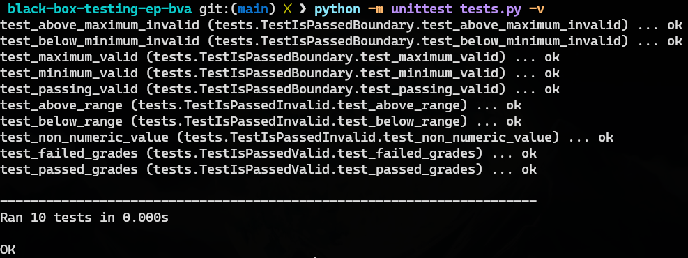

# Black Box Testing – EP & BVA

## Objective

This project demonstrates black box testing using Python’s `unittest` framework.

It evaluates input validation and boundary conditions for a simple function that determines whether a grade is passing or not.

## Requirements

* **Python** — Programming language used for the tests.
* **unittest** — Built-in Python module for unit and integration testing.

## Setup Instructions

### Clone the Repository

```bash
git clone https://github.com/PumukyDev/black-box-testing-ep-bva.git
cd black-box-testing-ep-bva
```

### Tests

```bash
python -m unittest tests.py -v
```



## Documentation

You can view the full project documentation in [PDF](https://github.com/PumukyDev/black-box-testing-ep-bva/blob/gh-pages/ebook.pdf) or the [web page version](https://pumukydev.github.io/black-box-testing-ep-bva)

## License

This project is under [MIT License](https://github.com/PumukyDev/black-box-testing-ep-bva/blob/main/LICENSE)